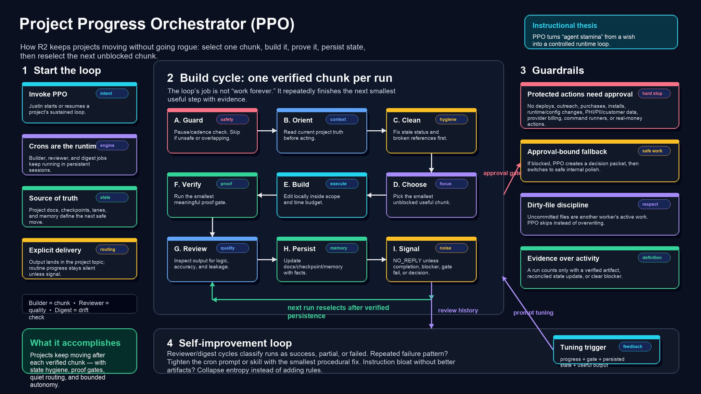

# Project Progress Orchestrator (PPO)

> The first open-source release from DrC.ai — a skill for keeping autonomous projects moving.

---

## What This Is

```yaml
name: project-progress-orchestrator
description: Keep active projects moving cleanly with autonomous or manual work cycles. Designed to improve itself — the skill molds to your specific build patterns and goals through evidence-backed self-tightening after each cycle.
```

The **Project Progress Orchestrator** (PPO) is a structured workflow pattern for autonomous agents that keeps projects moving without human micromanagement. It was developed by Dr. Justin Crosby as part of his work building agentic systems long before "agent loops" became a mainstream concept.

This skill represents the foundational loop that powers autonomous project execution: orient, clean, choose, build, verify, review, persist, and communicate — all while respecting approval boundaries and staying silent unless there's real signal.

**What makes PPO different:** It improves itself. After every cycle, the skill evaluates its own performance, tightens procedures based on concrete failure patterns, and molds to your specific build patterns and project goals. The loop learns what works for *your* codebase, *your* team, and *your* delivery cadence — not generic best practices.

---

## The Story

In early 2025, I started building R2 — an AI assistant that could actually get things done without me watching every step. The problem: most agent demos were impressive one-offs, but none could sustain meaningful work across days or weeks.

I needed a loop. Something that could:
- Wake up, understand where a project stood
- Clean up stale state before building
- Pick one concrete, unblocked chunk
- Build it, verify it, review it
- Persist what happened
- Stay quiet unless there was something I needed to know

PPO emerged from that need. It predates the "agent loop" terminology that became popular later. This was just how I taught R2 to work.

---

## The Core Loop

```
┌─────────────────────────────────────────────────────────────────┐
│  ORIENT  →  CLEAN  →  CHOOSE  →  BUILD  →  VERIFY  →  REVIEW   │
│     ↑                                                            │
│     └────────────────  PERSIST  ←  COMMUNICATE  ←───────────────┘
└─────────────────────────────────────────────────────────────────┘
```

1. **Orient** — Read the project contract, check for pause signals, understand current state
2. **Clean** — Fix stale claims, reconcile contradictions, settle recent work
3. **Choose** — Pick one concrete, unblocked chunk (respecting reviewer findings)
4. **Build** — Execute with a time budget, avoiding overlapping work
5. **Verify** — Run gates: lint, build, test, inspection
6. **Review** — Check output quality, catch errors before persistence
7. **Persist** — Write durable state: what changed, what's next, cycle-complete marker
8. **Communicate** — Silent by default; signal only when human action needed

---

## The Skill

See [`SKILL.md`](SKILL.md) for the complete specification including:
- Cron lifecycle management (start, stop, pause, status)
- Complete 10-step core loop with detailed instructions
- Reviewer Finding Contract (enforceable state, not prose)
- PM Escalation Template for human-in-the-loop decisions
- Digest patterns for twice-daily summaries
- Claude/Opus routing guards
- Delivery wiring requirements

---

## The Diagram



*An instructional diagram showing the PPO actor-critic style policy loop — note: this diagram illustrates the reinforcement learning-inspired conceptual model, not the operational workflow.*

---

## From PPO to Praxis

This skill is the foundation of **Praxis** — a harness for agent teams that we're building at DrC.ai.

While PPO defines the loop for a single project, Praxis extends it to:
- **Typed role contracts** — builder, reviewer, digest, auditor, improver
- **Explicit leases** — preventing overlapping work across agents
- **Run ledger** — durable, observable state for every cycle
- **Evaluator contracts** — machine-checkable outputs instead of prose claims
- **Meta-harness layering** — coordination across multiple projects

PPO proved the internal loop works. Praxis turns that proof into a product.

---

## Who Built This

**Dr. Justin Crosby** — a physician and systems thinker who started building with AI agents in early 2025. This is his first public open-source release. DrC.ai is his vehicle for exploring how autonomous agents can actually get things done.

---

## Usage

PPO is designed to run inside [OpenClaw](https://github.com/openclaw/openclaw) or compatible agent runtimes via scheduled cron jobs:

- **Builder loop** — every 30-60 min: cleanup-first, one chunk, verify, persist
- **Quality reviewer** — evaluates recent cycles for measurable progress
- **Twice-daily digest** — 9 AM / 9 PM summaries for human visibility

### Getting Started

This repo includes a **generic version** (`SKILL.md`) with placeholders for easy adaptation:

1. Read `SETUP.md` for customization instructions
2. Replace placeholders (`<USER_NAME>`, `<PM_TOPIC_ID>`, etc.) with your values
3. See `SKILL-ORIGINAL.md` for the author's reference implementation

The skill works with any runtime that can trigger the 10-step loop and handle messaging.

---

## License

MIT — Use it, fork it, build on it. If you find it useful, let us know what you're building.

---

## Connect

- DrC.ai — [drc.ai](https://drc.ai)
- Built with R2 — the agent that runs on this loop every day

---

> *"The loop is the product. Everything else is packaging."*